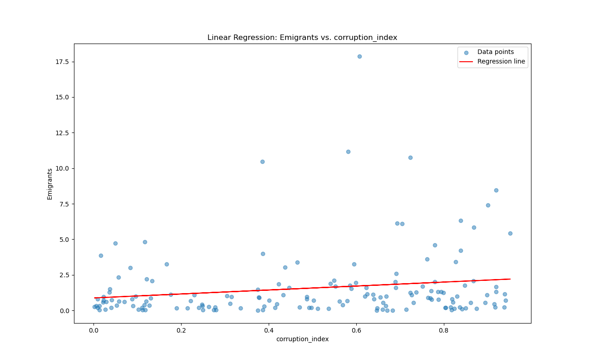
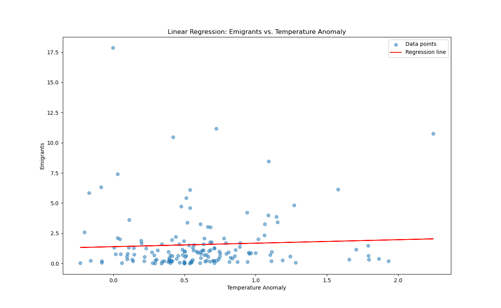
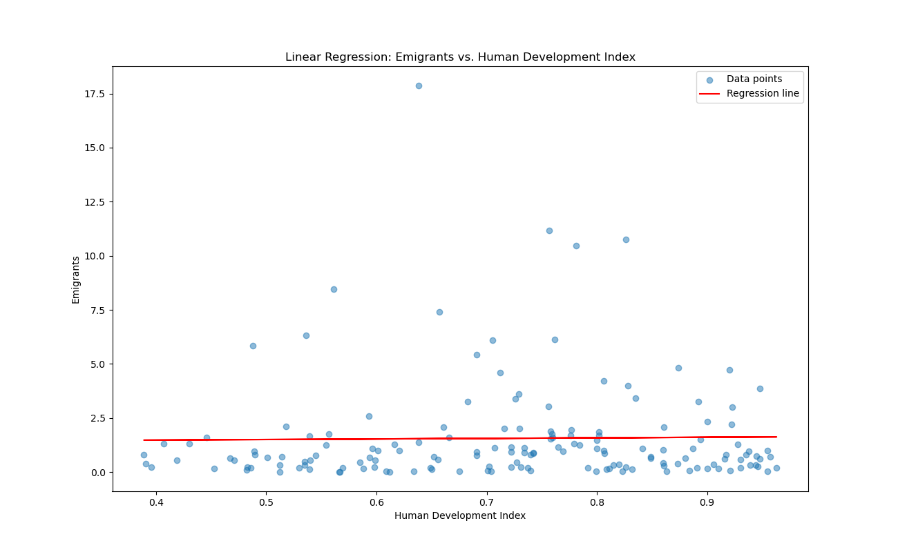

# Read Me

# Project MIGAN (Migration Information Geospatial Analysis Network)
Overview:
Project MIGAN aims to analyze the relationship between migration
and various independent variables such as temperature anomalies,
political corruption, and human development for the year 2020.
Information were collected from https://ourworldindata.org/

# Description of Files:
Migan_Analysis.py: Python script containing the main analysis code.
world-bounds-a.zip: Zip file containing shapefile for global boundaries.
stats.csv: CSV file containing data for linear regression analysis.
Migan Stas: has to create linear regression model
Regression line.py:has a regression line loop with the ability to run linear 
regression on the various variables
migan.dta: a file for those interested in running the statistical analysis on Stata
README.md: This README file.

# Steps:
The script loads data from CSV files for temperature anomalies, migration, political corruption, and human development.
It filters the data for the year 2020 and performs necessary cleaning and preprocessing.
Geo boundaries shapefile is extracted and read.
Dataframes are merged based on country entities.
Linear regression analysis is performed to analyze the relationship between independent variables and emigrants.
Results are saved as CSV files and shapefiles.

#Mapping

Data was collected and included in an interactive tableau map. 

[Tableau Public](https://public.tableau.com/views/MIGAN/Dashboard1?:language=en-US&publish=yes&:sid=&:display_count=n&:origin=viz_share_link)

# Results

## Regression Summary

The regression results provide valuable insights into the relationship
 between the dependent variable (Emigrants) and the independent variables
  (Corruption Index, Temperature Anomaly, and Human Development Index).
  
                            OLS Regression Results                            
==============================================================================
Dep. Variable:              Emigrants   R-squared:                       0.064
Model:                            OLS   Adj. R-squared:                  0.045
Method:                 Least Squares   F-statistic:                     3.493
Date:                Mon, 06 May 2024   Prob (F-statistic):             0.0172
Time:                        22:31:30   Log-Likelihood:                -357.25
No. Observations:                 158   AIC:                             722.5
Df Residuals:                     154   BIC:                             734.8
Df Model:                           3                                         
Covariance Type:            nonrobust                                         
===========================================================================================
                              coef    std err          t      P>|t|      [0.025      0.975]
-------------------------------------------------------------------------------------------
const                      -2.3303      1.483     -1.571      0.118      -5.260       0.599
Temperature anomaly         0.2610      0.455      0.574      0.567      -0.638       1.160
Corruption Index            2.6272      0.830      3.165      0.002       0.988       4.267
Human Development Index     3.3928      1.690      2.007      0.046       0.054       6.732
==============================================================================
Omnibus:                      151.815   Durbin-Watson:                   1.842
Prob(Omnibus):                  0.000   Jarque-Bera (JB):             2402.140
Skew:                           3.585   Prob(JB):                         0.00
Kurtosis:                      20.706   Cond. No.                         18.1
==============================================================================
Notes:
[1] Standard Errors assume that the covariance matrix of the errors is correctly specified.

###Analysis
R-squared value of 0.064 indicates that approximately
6.4% of the variance in emigrants can be explained by the independent variables included in the model.

The adjusted R-squared value of 0.045 suggests that after adjusting for the number of predictors,
the model explains around 4.5% of the variance in emigrants

the F-statistic is 3.493, and the associated p-value is 0.0172.
This indicates that the regression model is statistically significant at the 5% level,
suggesting that at least one of the independent variables has a non-zero effect on the dependent variable.

The coefficient for the "Corruption Index" variable is 2.6272.
This suggests that, on average, for a one-unit increase in the Corruption Index,
the number of emigrants increases by approximately 2.63 units, holding other variables constant.

A p-value less than the chosen significance level (usually 0.05) suggests that
the coefficient is statistically significant. In this case,
both the "Corruption Index" and "Human Development Index" variables have p-values less than 0.05,
indicating that they are statistically significant predictors of the number of emigrants.
However, the "Temperature Anomaly" variable does not have
a statistically significant effect on the number of emigrants

Overall, while the regression model is statistically significant,
the explanatory power of the model is limited (R-squared = 0.064),
suggesting that there may be other factors not accounted for in the model that influence the number of emigrants.

Figures below provide a visual explanation to the results above

Corruption index linear regression model 

Temperature anomaly linear regression model

Human development index linear regression model

